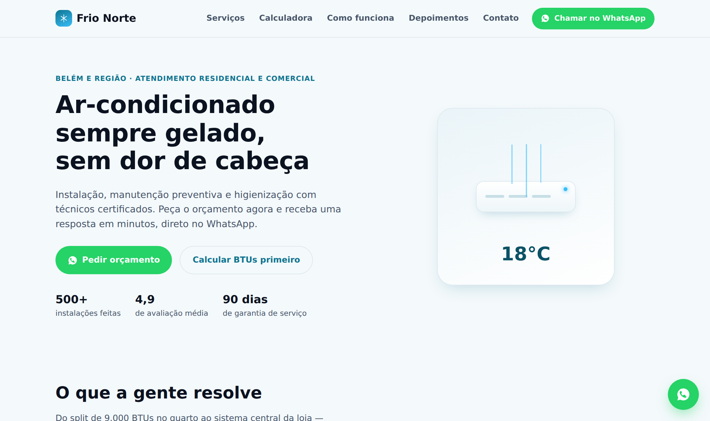
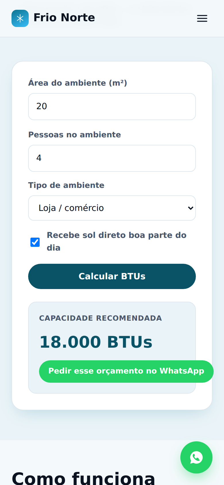

# Landing Page para Prestador de Serviço Local

Projeto de portfólio: uma landing page completa para um prestador de
serviço local, com captação de lead via WhatsApp — o formato mais
recorrente que encontrei numa pesquisa real de vagas no Workana e no
99Freelas (ver `## Por que esse nicho` abaixo).

<p align="center">
  
  
</p>

## O cenário simulado

**Frio Norte Climatização** — empresa fictícia de instalação, manutenção
e higienização de ar-condicionado em Belém/PA. Nicho escolhido porque é
plausível o ano inteiro na região (calor + umidade constantes), e porque
"landing page com calculadora interativa" apareceu literalmente como
pedido real numa das vagas encontradas na pesquisa.

> Frio Norte é fictícia: nome, depoimentos, número de WhatsApp e
> estatísticas ("500+ instalações") são todos inventados pra este
> projeto — isso está declarado no rodapé da própria página.

## Por que esse nicho

Antes de construir, pesquisei vagas reais no Workana e 99Freelas pra
identificar o padrão mais recorrente de pedido de landing page/site:

- **Prestador de serviço local com captação via WhatsApp** — padrão que
  se repete em vários anúncios reais (distribuidora de pneus, alarme
  monitorado), com área de atendimento, especialidade e CTA de contato
  direto. É o mais versátil: serve pra qualquer prestador (eletricista,
  encanador, personal trainer, clínica pequena), não só climatização.
- Também identifiquei **advocacia** e **produto/e-commerce (tráfego
  pago)** como nichos fortes — ficam como próximos projetos do
  portfólio, cada um com seu próprio ângulo (compliance OAB pra
  advocacia; foco em conversão de campanha pro e-commerce).

## Decisões de projeto

- **Sem framework, sem build step** — HTML/CSS/JS puro. Pro tipo de
  entrega (site institucional de poucas páginas), isso é uma vantagem
  real: carrega rápido, não tem dependência pra manter, e é exatamente o
  que a maioria dos pedidos desse nicho pede.
- **Calculadora de BTUs** funcional em JavaScript, com a fórmula
  aproximada real (~600 BTU/h por m², com ajuste pra cozinha, comércio,
  sol direto e número de pessoas) — não é só decoração, o resultado
  calculado já entra pré-preenchido na mensagem de WhatsApp gerada.
- **Botão flutuante de WhatsApp** com mensagem pré-definida — várias vagas
  reais pedem exatamente esse padrão de conversão.
- **Mobile-first**: menu hambúrguer abaixo de 900px, grid de 1 coluna,
  sem scroll horizontal em nenhum breakpoint testado (390px, 768px,
  1280px).

## Bug real encontrado no processo

O botão "Calcular BTUs" tinha um resultado que **aparecia mesmo antes de
clicar** — o elemento usava o atributo HTML `hidden`, mas uma regra CSS
própria (`.calc-result{display:flex}`) tinha a mesma especificidade que
o `[hidden]{display:none}` do navegador e vinha depois no CSS, então
vencia a "queda de braço" e cancelava o `hidden`. A correção foi declarar
`[hidden]{display:none!important}` explicitamente no início da folha de
estilo — garante que qualquer elemento marcado como escondido realmente
fique escondido, independente de outras regras de `display` na mesma
classe.

Um segundo bug: no celular, a seção da calculadora vazava ~30px pra fora
da tela. Causa: ao virar `grid-template-columns` pra uma coluna só no
mobile, os itens do grid (e os dois `<input>` lado a lado dentro dele)
mantinham a largura mínima de conteúdo (`min-width: auto` padrão do
navegador), maior que o espaço disponível. Corrigido com `min-width: 0`
explícito nos itens do grid.

## Estrutura

```
landing-prestador-servico/
├── README.md
├── docs/              -> screenshots usados neste README
├── index.html
├── css/style.css
└── js/script.js       -> menu mobile, calculadora de BTUs, geração dos links de WhatsApp
```

## Como rodar

Sem instalação nem servidor — é só abrir `index.html` no navegador, ou
publicar a pasta inteira em qualquer host de arquivo estático (é assim
que está publicado, ver README do portfólio na raiz do repositório).

## Stack

HTML5, CSS3 (custom properties, Grid, Flexbox), JavaScript vanilla.
